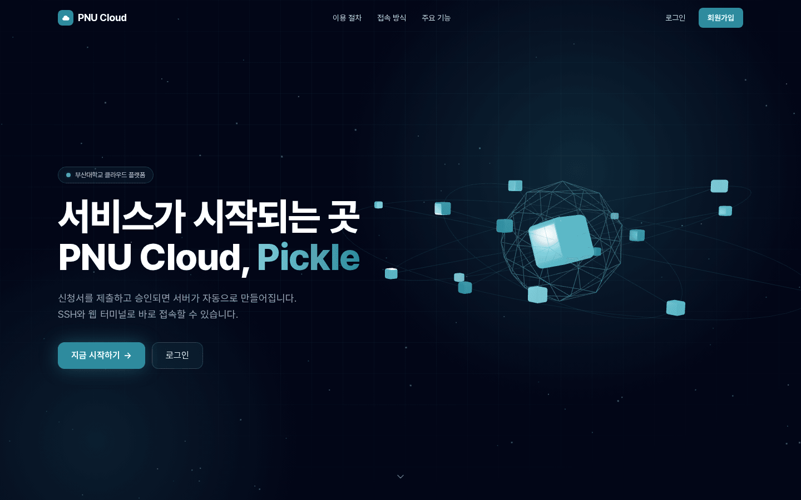
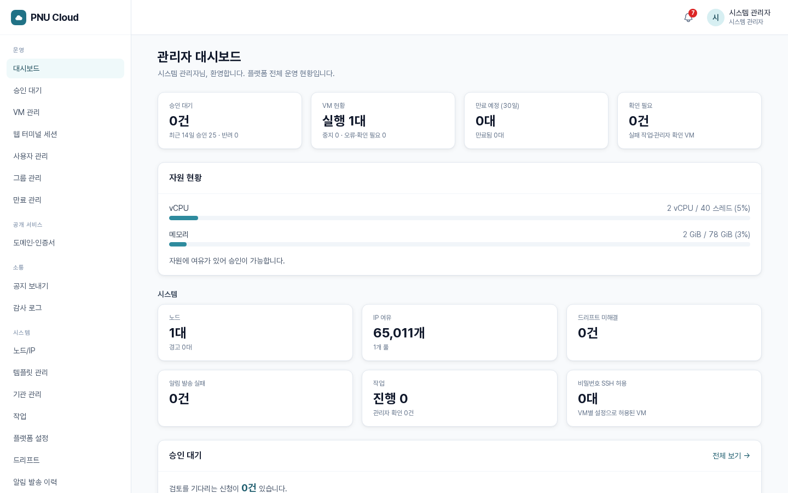
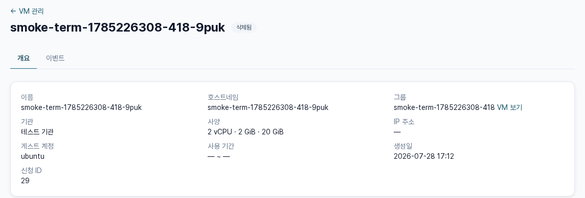
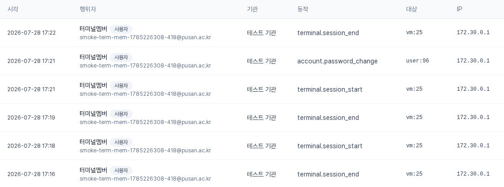
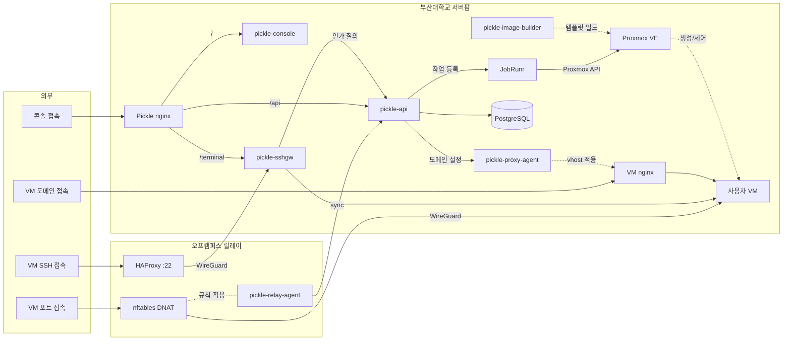

# pickle-console

부산대학교 클라우드 플랫폼(Pickle)의 웹 콘솔입니다.

랜딩 페이지부터 사용자 콘솔, 기관과 시스템 관리자 콘솔, 웹 터미널까지 사용자가
이 플랫폼을 만나는 모든 화면이 여기 있습니다. nginx가 정적 빌드 산출물을 서빙하는
SPA이고, 데이터는 전부 백엔드 API에서 받아옵니다.

접속: https://pickle.pusan.ac.kr

<p align="center">
  
</p>

## 화면

VM 신청서(4스텝), 승인 대기, 대시보드, SSH 키 등록, 웹 터미널, 도메인 공개로
이어지는 사용자 여정에 승인 큐와 감사 로그, 드리프트 리포트, 관리자 개입 같은 관리자
콘솔 화면이 더해집니다. 아래는 그중 관리자 쪽 세 화면입니다.

<table>
  <tr>
    <td><br/><sub>관리자 대시보드. 승인 대기, VM 현황, 리소스 요약</sub></td>
    <td><br/><sub>VM 상세. 개요와 이벤트 탭, 정보 카드</sub></td>
  </tr>
  <tr>
    <td colspan="2" align="center"><br/><sub>관리자 감사 로그. 민감한 동작은 행위자와 IP가 함께 남습니다</sub></td>
  </tr>
</table>

## 주요 기능

플랫폼은 VM 신청·승인·생성, SSH와 웹 터미널 접속, 도메인 공개, 만료와
삭제까지를 다룹니다. 이 레포지토리가 맡는 부분은 아래와 같습니다.

- **사용자 여정**: 회원가입부터 신청, 접속, 도메인 공개, 삭제까지 인프라를 몰라도 따라갈 수
  있게 안내합니다.
- **신청서**: 리소스 종류를 고르는 것으로 시작해 워크스페이스와 이름, OS와 사양, 용도와
  기간을 차례로 정합니다. 희망 호스트명(슬러그)은 여기서 직접 지정할 수 있습니다.
- **워크스페이스 스코프**: 사이드바 선택기로 워크스페이스 하나를 고르면 목록과 신청이 그
  범위로 좁혀지고, '전체'를 고르면 참여 중인 모든 워크스페이스를 한 번에 봅니다.
- **웹 터미널**: SSH 클라이언트나 키가 없어도 브라우저에서 바로 VM 셸을 엽니다.
- **접속 수단 관리**: SSH 공개키를 등록하거나 콘솔에서 발급받고, VM 초기 비밀번호를
  다시 열람하거나 재발급합니다.
- **도메인 공개**: 서브도메인을 직접 정해 VM의 웹 서비스를 공개하고, 필요하면 다시
  내립니다.
- **알림함**: 승인이나 만료 같은 사건이 쌓이고, 읽은 것과 안 읽은 것이 구분됩니다.
- **관리자 콘솔**: 승인 큐와 판단을 돕는 리소스 현황, 감사 로그, 드리프트 리포트, 관리자
  개입까지 다룹니다.

## 동작 방식

API는 항상 자기 오리진의 `/api`로 호출합니다. 로컬에서는 Vite 프록시가, 운영에서는
nginx가 같은 경로를 백엔드로 넘기므로 런타임 설정이 필요 없습니다.

TypeScript 타입은 백엔드가 생성한 OpenAPI 스펙에서 만들어 레포지토리에 커밋합니다. 명세가
바뀌면 diff에 드러나고, 스펙과 어긋난 코드는 타입 검사가 잡아냅니다.

테스트는 MSW로 API 전체를 목킹해 백엔드 없이 전 화면을 돌립니다. 핸들러 픽스처가
프론트엔드가 기대하는 응답의 문서 역할도 합니다.

웹 터미널의 WebSocket은 `/api` 밖의 `/terminal/ws`로 나갑니다. OpenAPI 표면과 API
런타임을 1:1로 유지하기 위해서이고, WS 종단은
[pickle-sshgw](https://github.com/PNUops/pickle-sshgw)의 터미널 브리지가 맡습니다.

## 스택

React 19, TypeScript, Vite 8, Tailwind 4, TanStack Query 5, react-router 8,
openapi-fetch. 웹 터미널은 xterm.js, 랜딩의 3D 히어로는 react-three-fiber를 사용합니다.
테스트는 vitest와 MSW 조합이고, 린트는 oxlint로 경고까지 실패로 취급합니다.

Node.js 24(LTS)가 필요합니다. `package.json`의 `engines`에 적혀 있습니다.

## 시작하기

```bash
npm install
npm run dev              # /api·/terminal/ws 를 로컬 pickle-api :8080 으로 프록시
scripts/verify.sh        # lint → typecheck → test → build → 취약점 감사 → 공개 위생 검사
```

| 명령 | 내용 |
|---|---|
| `npm run lint` / `npm run typecheck` | oxlint / `tsc -b` |
| `npm run test` / `npm run test:watch` | vitest 1회 실행 / 워치 |
| `npm run build` / `npm run preview` | 프로덕션 빌드 / 미리보기 |
| `npm run gen:api` | API 타입 재생성 |

`verify.sh` 안의 `npm audit --omit=dev --audit-level=high`와 공개 위생 검사는 차단
게이트입니다. 런타임 의존성에 high 이상 취약점이 있거나 내부 참조가 섞이면 검증이
실패합니다.

### 로그인 계정

로컬 백엔드를 dev 프로파일로 띄우면 빈 데이터베이스에 개발용 계정 둘이 만들어집니다.
시스템 관리자는 `admin@pickle.local`, 기관 관리자는 `orgadmin@pickle.local`입니다.
비밀번호는 백엔드를 기동할 때 환경 변수로 준 값이라 여기에는 적혀 있지 않습니다. 신청과
승인에 필요한 기관과 OS, 사양 프리셋도 같이 들어오므로 화면을 처음부터 따라갈 수
있습니다. 이 계정들은 dev 전용이고, 운영 환경에서는 운영자 부트스트랩 절차가 관리자
계정을 만듭니다.

## API 타입 생성

```bash
npm run gen:api   # ../api/contract/openapi.yaml → src/api/schema.d.ts
```

[pickle-api](https://github.com/PNUops/pickle-api) 레포지토리가 형제 디렉터리(`../api`)로
체크아웃돼 있다고 가정합니다. 산출물 `src/api/schema.d.ts`는 커밋 대상입니다.

## 레포지토리 구조

```
src/api/         생성된 타입(schema.d.ts)과 쿼리 래퍼
src/auth/        권한과 역할 판정
src/pages/       화면 (랜딩·사용자·관리자·터미널)
src/terminal/    웹 터미널 소켓 훅
src/components/  src/layouts/   공용 UI
src/lib/         상태·라벨 매핑, 포맷, 검증 유틸
src/test/        vitest 설정과 MSW 목
assets/          README 스크린샷
```

## 전체 아키텍처

<!-- arch:begin — 레포지토리 공통 블록입니다. 손으로 고치지 마세요. -->


| 레포지토리 | 역할 |
|---|---|
| [pickle-api](https://github.com/PNUops/pickle-api) | REST API와 프로비저닝 워커 (Spring Boot 4, Java 25, PostgreSQL 18, JobRunr) |
| [pickle-console](https://github.com/PNUops/pickle-console) | 사용자·관리자 웹 콘솔 (React 19, TypeScript) |
| [pickle-sshgw](https://github.com/PNUops/pickle-sshgw) | SSH 게이트웨이와 웹 터미널 브리지 (sshpiperd, Go) |
| [pickle-proxy-agent](https://github.com/PNUops/pickle-proxy-agent) | nginx 리버스 프록시 제어 에이전트 (Go) |
| [pickle-relay-agent](https://github.com/PNUops/pickle-relay-agent) | 오프캠퍼스 릴레이의 nftables DNAT 에이전트 (Go) |
| [pickle-image-builder](https://github.com/PNUops/pickle-image-builder) | 사용자 VM OS 이미지 빌드 레시피 (shell, virt-customize) |
| [pickle-infra](https://github.com/PNUops/pickle-infra) (비공개) | 인프라 프로비저닝 스크립트와 운영 런북 (shell) |
| [pickle-infra-example](https://github.com/PNUops/pickle-infra-example) | 프로비저닝·배포 스크립트와 런북 샘플 |
| [pickle-secrets](https://github.com/PNUops/pickle-secrets) (비공개) | 호스트 시크릿 볼트 (git-crypt) |
| [pickle-secrets-example](https://github.com/PNUops/pickle-secrets-example) | 볼트 레이아웃과 git-crypt 운용 절차 |
<!-- arch:end -->
