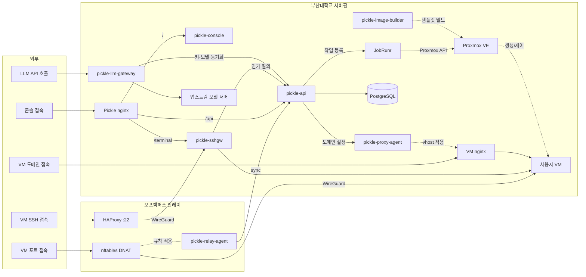

# pickle-console

부산대학교 클라우드 플랫폼(Pickle)의 웹 콘솔입니다.

랜딩 페이지부터 사용자 콘솔, 기관과 시스템 관리자 콘솔, 웹 터미널까지 사용자가
이 플랫폼을 만나는 모든 화면이 여기 있습니다. nginx가 정적 빌드 산출물을 서빙하는
SPA이고, 데이터는 전부 백엔드 API에서 받아옵니다.

접속: https://pickle.pusan.ac.kr

<p align="center">
  
</p>

## 화면

리소스 신청, 승인 대기, 대시보드, SSH 키 등록, 웹 터미널, 도메인 공개로
이어지는 사용자 여정에 승인 큐와 감사 로그, 드리프트 리포트, 관리자 개입 같은 관리자
콘솔 화면이 더해집니다. 아래는 그중 관리자 쪽 세 화면입니다.

<table>
  <tr>
    <td><br/><sub>관리자 대시보드. 승인 대기, VM 현황, 리소스 요약</sub></td>
    <td><br/><sub>VM 상세. 개요와 이벤트 탭, 정보 카드</sub></td>
  </tr>
  <tr>
    <td colspan="2" align="center"><br/><sub>관리자 감사 로그. 민감한 동작은 행위자와 IP가 함께 남습니다</sub></td>
  </tr>
</table>

## 주요 기능

플랫폼은 VM 신청·승인·생성, SSH와 웹 터미널 접속, 도메인 공개, 만료와
삭제까지를 다룹니다. 이 레포지토리가 맡는 부분은 아래와 같습니다.

- **사용자 여정**: 회원가입부터 신청, 접속, 도메인 공개, 삭제까지 인프라를 몰라도 따라갈 수
  있게 안내합니다.
- **신청서**: 리소스 종류를 고르고, 만들 리소스(이름과 OS, 사양)를 정한 뒤, 누구 명의로
  왜 언제까지 쓸지를 적습니다. 종류를 아는 자리에서 들어오면 첫 단계는 접힙니다. 사양은
  준비된 것을 고르거나 직접 적을 수 있고, 직접 적으면 사유를 받아 관리자가 검토합니다.
  접속 이름(SSH 접속명)도 여기서 직접 정할 수 있습니다.
- **워크스페이스 스코프**: 사이드바 선택기로 워크스페이스 하나를 고르면 그 워크스페이스가
  가진 리소스와 신청을 전부 보고, 접근 권한이 없는 리소스는 이름과 상태, 소유자까지
  보입니다. '전체'를 고르면 워크스페이스를 가리지 않고 본인이 접근 권한을 가진 리소스와
  본인이 낸 신청만 봅니다.
- **웹 터미널**: SSH 클라이언트나 키가 없어도 브라우저에서 바로 VM 셸을 엽니다.
  별도 창으로 열려 화면 전체를 쓰고, 창 크기를 조절하면 터미널 크기도 따라갑니다.
- **접속 수단 관리**: SSH 공개키를 등록하거나 콘솔에서 발급받고, VM 초기 비밀번호를
  다시 열람하거나 재발급합니다.
- **도메인 공개**: 서브도메인을 직접 정해 VM의 웹 서비스를 공개하고, 필요하면 다시
  내립니다.
- **도메인**: VM 없이 이름만 받아 A, AAAA, CNAME, TXT 레코드를 직접 편집합니다.
  다른 리소스와 같은 신청으로 받고, 고른 루트 도메인에 따라 접수와 동시에 발급되거나
  관리자 검토를 거칩니다. 대상은 이 플랫폼 밖 서버여도 됩니다.
  레코드 편집기는 표 전체를 저장하므로 표에서 지운 줄은 존에서도 지워집니다.
  사용 기한이 있고 연장하지 않으면 이름이 회수됩니다.
- **LLM API 키**: 승인받은 키를 목록에서 확인하고 상세에서 직접 발급합니다. 평문은 발급
  응답에서 한 번만 보이고 서버에는 해시만 남으므로 화면도 그렇게 다룹니다 — 값을
  잃어버렸으면 재발급(이전 값은 그 자리에서 무효), 유출됐으면 폐기입니다. 사용량 탭은
  일별 요청·토큰과 한도에 걸려 거부된 요청을 보여 줍니다.
- **알림함**: 승인이나 만료 같은 사건이 쌓이고, 읽은 것과 안 읽은 것이 구분됩니다.
- **관리자 콘솔**: 가상머신·LLM API 키 신청을 종류별 참고 정보로 검토하고, 승인된 LLM
  API 키의 6개 한도와 정지·해제·폐기를 역할과 상태에 맞게 관리합니다. Gateway·upstream의
  관측 상태와 최종 처리 지표를 읽습니다. LLM 사용량 화면은 7·30·90일 수요와 scope-aware
  소비처, 실제 한도 소진과 정확한 차단 사유를 보여 주며 집계, 사용량 수신, OpenRouter
  사용액, 전송 대기열의 확인 시각을 함께 표시합니다. 기관별 OpenRouter 사업 계정 화면에서는
  사업과 담당자, 관리용 키의 등록·교체 상태를 관리하고, 저장된 구매 금액, 누적 사용액,
  잔액, 소진 예상과 Pickle 밖에서 쓴 금액을 각 확인 시각과 함께 읽습니다. 이 값은 화면
  요청 때 OpenRouter를 직접 부른 값이 아니며, 마지막 성공·시도·실패와 키 대사 신선도를
  나누어 표시합니다. 유료 모델을 승인할 때 승인자가 사업 계정을 고르고, 한 번 정해진
  연결은 화면에서 바꿀 수 없습니다. 리소스 현황, 감사 로그, 드리프트 리포트와 관리자
  개입도 함께 다룹니다.

  시각 표기는 자리에 따라 하나만 씁니다. 지금 얼마나 신선한지를 묻는 자리(상태, 잔액,
  관측)는 상대 표기만, 언제 있었는지를 기록하는 자리(감사, 활동 내역, 생성·변경일)는
  절대 표기만 쓰고 둘을 나란히 두지 않습니다.

## 동작 방식

API는 항상 자기 오리진의 `/api`로 호출합니다. 로컬에서는 Vite 프록시가, 운영에서는
nginx가 같은 경로를 백엔드로 넘기므로 런타임 설정이 필요 없습니다.

TypeScript 타입은 백엔드가 생성한 OpenAPI 스펙에서 만들어 레포지토리에 커밋합니다. 명세가
바뀌면 diff에 드러나고, 스펙과 어긋난 코드는 타입 검사가 잡아냅니다.

테스트는 MSW로 API 전체를 목킹해 백엔드 없이 전 화면을 돌립니다. 핸들러 픽스처가
프론트엔드가 기대하는 응답의 문서 역할도 합니다.

웹 터미널의 WebSocket은 `/api` 밖의 `/terminal/ws`로 나갑니다. OpenAPI 표면과 API
런타임을 1:1로 유지하기 위해서이고, WS 종단은
[pickle-sshgw](https://github.com/PNUops/pickle-sshgw)의 터미널 브리지가 맡습니다.
바로 옆의 `/terminal/<vm uuid>`는 터미널 창 화면으로 이 앱이 가집니다 — 라우터가
아니라 `src/main.tsx`가 주소를 보고 문서를 가르며, UUID인 경로만 창으로 인정하므로
브리지가 쓰는 `/terminal/ws`와 겹치지 않습니다. 이 창은 콘솔의 인증 스택을 얹지
않고 접속 티켓을 콘솔 탭에서 `postMessage`로 받습니다. 창이 스스로 세션을 복원하면
리프레시 토큰 회전 검사가 콘솔 탭과 충돌해 모든 탭이 로그아웃되기 때문입니다.

## 사용 가이드

`/docs`에서 서비스 소개, 가입, 신청과 승인, 워크스페이스 공유, 가상머신, 도메인과 네트워크,
LLM API, 계정과 문제 해결을 로그인 없이 읽을 수 있습니다. 콘솔 메뉴의 사용 가이드는
현재 헤더와 선택한 워크스페이스 및 기관을 유지하며 왼쪽 리소스 메뉴를 문서 목차로
바꿉니다. 모바일에서는 상단 메뉴 버튼으로 목차를 엽니다. 사이드바 맨 위에는 제목과
키워드 검색이 고정되고 그 아래로 목차가 스크롤됩니다. 본문은 번호가 있는 절 목차와
이전·다음 문서, 원래 작업 화면으로 돌아가는 링크를 제공합니다.
랜딩의 서비스 소개 버튼도 `/docs`로 연결되며 로그인 후에도 콘솔 이동 버튼 옆에 표시됩니다.

본문은 `src/docs/articles/`에서 작성하고 `src/docs/catalog.ts`에 등록합니다.
각 문서는 `GuideArticle`의 제목과 검색 키워드, 고정 slug, 절별 id와 본문을 갖습니다.
본문의 문서 링크에는 `GuideLink`, 사용자 작업으로 가는 링크에는 `GuideAction`을 사용합니다.
문서 링크와 공개 경로 변환은 `src/lib/docs-paths.ts`가 맡습니다.

화면 예시는 `src/assets/docs/`의 PNG를 기사에서 import하고 `GuideFigure`로 표시합니다.
이미지마다 대체 텍스트와 캡션을 작성하며, 실제 메뉴 위치와 확인할 대상을 설명합니다.
이미지를 선택하면 같은 원본을 새 탭에서 볼 수 있습니다. 원본의 너비와 높이를 함께
지정하면 지연 로딩 중에도 이미지가 차지할 공간을 유지합니다.

메뉴 이름과 화면 배치, 권한 또는 상태 표시가 바뀌면 관련 이미지와 설명을 함께
갱신합니다. 예시 화면은 개인정보와 자격증명이 없는 데이터로 촬영하고, 확인할 영역만
담아 글자를 읽을 수 있는 크기로 유지합니다. 캡처에 나온 사용량과 한도는 현재 정책의
근거로 사용하지 않습니다. 새 이미지가 연결된 문서의 렌더링과 원본 링크, 좁은 화면에서의
표시를 확인하며, 하나의 원본은 가장 관련 있는 절에 배치합니다.

공개 `/docs/*`, 사용자 `/console/docs/*`, 워크스페이스별 `/console/:workspaceId/docs/*`,
관리자 `/admin/docs/*`는 같은 본문을 공유합니다. 새 문서는 실제 화면의 메뉴와 버튼,
권한, 완료 확인 방법까지 대조하고 문서 링크 검사와 화면 테스트를 함께 실행합니다.

## 유료 모델 규칙

LLM 키 승인, 관리자 한도 변경, OpenRouter 사업 계정의 승인 기본값은 하나의 입력란에서
허용과 차단 규칙을 함께 편집합니다. 한 줄에 한 규칙을 적고 허용에는 `+`, 차단에는 `-`를
붙입니다. 전체 내용을 한 번에 복사해 다른 입력란에 붙여 넣을 수 있습니다.

```text
+openai/*
+anthropic/*
+google/*
-*/*-pro
```

공급자 자리의 `*`는 모든 공급자와 `~`로 시작하는 별칭을 포함합니다. 모델 자리에는
정확한 이름, `gpt-5-*` 같은 계열, `*-pro` 같은 끝 이름 패턴을 사용합니다.
차단이 허용보다 우선하며 줄 순서는 결과에 영향을 주지 않습니다. `+` 규칙이 없으면
금액 한도 안에서 모든 유료 모델을 허용하고, `-` 규칙이 없으면 차단하지 않습니다.
자체 서빙 모델은 이 규칙의 대상이 아닙니다.

정확한 모델 이름은 `:batch` 같은 변형도 포함합니다. 특정 공급자를 허용할 때는 `~` 별칭을
따로 적으며, 특정 공급자의 차단은 별칭에도 적용됩니다. 규칙이 하나라도 있으면 모델을
대신 선택하는 `openrouter/` 이름은 사용할 수 없습니다. 계정 기본값 변경은 다음 승인에
미리 채울 값만 바꾸며 이미 발급된 키에는 적용되지 않습니다.

## GPU 개발 미리 보기

GPU 신청·할당·VM 연결·반납과 관리자 검토 화면은 개발 모드에서
`VITE_GPU_PREVIEW=1 npm run dev:mock`으로 확인합니다. `/console/gpus`는 사용자
목록이며 `/admin/gpus`는 관리자 인벤토리·대기열·검토 화면입니다. 실습할 데이터는
`src/test/msw/handlers/gpu.ts`의 픽스처로 지정합니다. 개발 미리 보기는 할당·대기·연결 오류
예시를 불러오며 테스트 초기 인벤토리는 비어 있습니다. 미리 보기에서 처리하지 못한 API
호출은 오류로 막아 실제 백엔드에 전달하지 않습니다.

GPU 임대 기간은 신청자와 승인자가 시간 또는 일 단위로 직접 입력합니다. 미연결·저사용
검토 기준은 관리자 플랫폼 설정의 현재값을 사용하며 임대 기간과 별개입니다. VM 연결은
대상과 전원 변경을 확인한 뒤 실행하고, 연결 해제 후에도 임대는 유지됩니다.

기본 개발 모드와 production 빌드에서는 GPU 경로와 신청 선택을 열지 않습니다.
사이드바의 GPU는 준비 중으로 유지하며 실제 서비스 개방은 별도로 진행합니다.

## 공개 출발지 정책 기능 플래그

도메인과 포트포워딩의 출발지 정책 화면은 `VITE_PUBLIC_SOURCE_POLICY_ENABLED=1`인
빌드에서만 노출합니다. 변수를 지정하지 않거나 다른 값을 넣으면 화면을 표시하지 않습니다.
이 플래그는 화면 노출만 제어하며 API 권한 검사를 대신하지 않습니다. 정책을 바꿔도 이미
연결된 세션을 강제로 종료하지 않고 새 연결부터 적용합니다.
서비스가 연결된 도메인은 IPv4·IPv6 주소와 CIDR을 받고, 포트포워딩은 relay 집행 범위에
맞춰 IPv4만 받습니다. 플랫폼이 트래픽을 중계하지 않는 DNS 전용 도메인에는 이 화면을
표시하지 않습니다. 상태는 비활성·반영 대기·설정 확인·설정 실패로 구분하며 내부 적용
세대 숫자는 사용자 흐름에 노출하지 않습니다. 교내 preset은 현재 CIDR을 입력 목록에
추가하는 snapshot이며 저장 뒤 자동으로 바뀌지 않습니다.

## 스택

React 19, TypeScript, Vite 8, Tailwind 4, TanStack Query 5, react-router 8,
openapi-fetch. 웹 터미널은 xterm.js, 랜딩의 3D 히어로는 react-three-fiber, 사용량·용량
추이 차트는 uPlot을 사용합니다. 무거운 세 가지는 모두 해당 화면을 열 때만 내려받도록
코드 분할해 두었습니다. 2단계 인증 등록 화면의 QR 코드는 qrcode.react가 SVG로 그립니다.
테스트는 vitest와 MSW 조합이고, 린트는 oxlint로 경고까지 실패로 취급합니다.

Node.js 24(LTS)가 필요합니다. `package.json`의 `engines`에 적혀 있습니다.

## 시작하기

```bash
npm install
npm run dev              # /api·/terminal/ws 를 로컬 pickle-api :8080 으로 프록시
npm run dev:mock         # api 없이 목 데이터로 실행
scripts/verify.sh        # lint → typecheck → test → build → 취약점 감사
```

`dev:mock` 은 데이터베이스도 api도 없이 화면만 띄웁니다. 테스트가 쓰는 목 핸들러를 그대로
브라우저에 물리므로 로그인부터 신청, 승인까지 눌러 볼 수 있고, 접속 이름 중복처럼 서버만
아는 실패도 그대로 재현됩니다. 저장되는 것은 없고 새로고침하면 처음 상태로 돌아갑니다.
목 코드는 운영 번들에 들어가지 않습니다(동적 import 와 `import.meta.env.DEV` 가드).

| 명령 | 내용 |
|---|---|
| `npm run lint` / `npm run typecheck` | oxlint / `tsc -b` |
| `npm run test` / `npm run test:watch` | vitest 1회 실행 / 워치 |
| `npm run build` / `npm run preview` | 프로덕션 빌드 / 미리보기 |
| `npm run gen:api` | API 타입 재생성 |

`verify.sh` 안의 `npm audit --omit=dev --audit-level=high`는 차단 게이트입니다. 런타임
의존성에 high 이상 취약점이 있으면 검증이 실패합니다.

### 로그인 계정

로컬 백엔드를 dev 프로파일로 띄우면 빈 데이터베이스에 개발용 계정 둘이 만들어집니다.
시스템 관리자는 `admin@pickle.local`, 기관 관리자는 `orgadmin@pickle.local`입니다.
비밀번호는 백엔드를 기동할 때 환경 변수로 준 값이라 여기에는 적혀 있지 않습니다. 신청과
승인에 필요한 기관과 OS, 사양 프리셋도 같이 들어오므로 화면을 처음부터 따라갈 수
있습니다. 이 계정들은 dev 전용이고, 운영 환경에서는 운영자 부트스트랩 절차가 관리자
계정을 만듭니다.

## API 타입 생성

```bash
npm run gen:api   # ../api/contract/openapi.yaml → src/api/schema.d.ts

# 별도 checkout이나 worktree의 명세를 사용할 때
OPENAPI_SCHEMA=/absolute/path/to/openapi.yaml npm run gen:api
```

[pickle-api](https://github.com/PNUops/pickle-api) 레포지토리가 형제 디렉터리(`../api`)로
체크아웃돼 있다고 가정합니다. `OPENAPI_SCHEMA`를 지정하면 그 파일을 입력으로 사용하며
출력은 그대로 `src/api/schema.d.ts`입니다. 산출물은 커밋 대상입니다.

## 레포지토리 구조

```
src/api/         생성된 타입(schema.d.ts)과 쿼리 래퍼
src/auth/        권한과 역할 판정
src/pages/       화면 (랜딩·사용자·관리자)
src/terminal/    웹 터미널 창 — 화면·소켓 훅·콘솔 탭과의 티켓 중계
src/components/  src/layouts/   공용 UI
src/lib/         상태·라벨 매핑, 포맷, 검증 유틸
src/test/        vitest 설정과 MSW 목
public/          빌드가 그대로 내보내는 정적 파일
assets/          README 스크린샷
```

`public/pnu-logo.png`는 지우거나 이름을 바꾸지 마세요. 콘솔 소스가 참조하지 않아 쓰이지
않는 것처럼 보이지만, favicon이 `/pnu-logo.png`로 가리키고 발송 메일의 HTML 상단도 같은
파일을 절대 URL로 불러옵니다. 없어져도 nginx가 SPA 껍데기를 200으로 돌려주므로 배포
검사에 걸리지 않고, 이미 발송된 메일의 로고까지 함께 깨집니다. 엠블럼을 교체할 때는 이
파일과 `src/assets/pnu-logo.png`를 같이 바꿔야 favicon과 메일이 화면 속 로고와 어긋나지
않습니다.

## 전체 아키텍처

<!-- arch:begin -->


| 레포지토리 | 역할 |
|---|---|
| [pickle-api](https://github.com/PNUops/pickle-api) | REST API와 프로비저닝 워커 (Spring Boot 4, Java 25, PostgreSQL 18, JobRunr) |
| [pickle-console](https://github.com/PNUops/pickle-console) | 사용자·관리자 웹 콘솔 (React 19, TypeScript) |
| [pickle-sshgw](https://github.com/PNUops/pickle-sshgw) | SSH 게이트웨이와 웹 터미널 브리지 (sshpiperd, Go) |
| [pickle-proxy-agent](https://github.com/PNUops/pickle-proxy-agent) | nginx 리버스 프록시 제어 에이전트 (Go) |
| [pickle-relay-agent](https://github.com/PNUops/pickle-relay-agent) | 오프캠퍼스 릴레이의 nftables DNAT 에이전트 (Go) |
| [pickle-llm-gateway](https://github.com/PNUops/pickle-llm-gateway) | 교내 LLM API 게이트웨이 (Go) |
| [pickle-image-builder](https://github.com/PNUops/pickle-image-builder) | 사용자 VM OS 이미지 빌드 레시피 (shell, virt-customize) |
| [pickle-infra](https://github.com/PNUops/pickle-infra) (비공개) | 인프라 프로비저닝 스크립트와 운영 런북 (shell) |
| [pickle-infra-example](https://github.com/PNUops/pickle-infra-example) | 프로비저닝·배포 스크립트와 런북 샘플 |
| [pickle-secrets](https://github.com/PNUops/pickle-secrets) (비공개) | 호스트 시크릿 볼트 (git-crypt) |
| [pickle-secrets-example](https://github.com/PNUops/pickle-secrets-example) | 볼트 레이아웃과 git-crypt 운용 절차 |
<!-- arch:end -->
